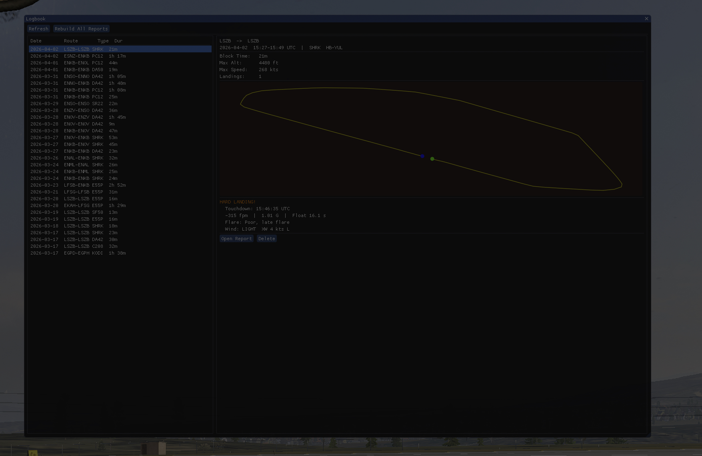

# xp_pilot


A native X-Plane 12 plugin for **macOS (ARM + Intel)**, **Linux** and **Windows** that combines three quality-of-life features for general aviation and jet simulation:

- **Flight Logger** — records every flight and generates an HTML logbook with route maps and landing analysis
- **Auto QNH** — automatically keeps the altimeter in sync with actual sea-level pressure
- **Rain Blocker** — suppresses X-Plane's 3D rain particle effect at high speed (>120 kts)

---

## Features

### Flight Logger

Records a complete flight from engine start to shutdown and saves it as JSON plus an HTML report.

- Detects takeoff, airborne phase, landing, and shutdown automatically via a state machine
- Samples track points every 10 seconds (lat/lon, altitude, speed, vertical speed)
- Captures landing data at touchdown: descent rate (fpm), G-force, pitch, float time, flare quality, wind (headwind/crosswind)
- Rates each landing: **BUTTER!** / **GREAT LANDING!** / **ACCEPTABLE** / **HARD LANDING!** / **WASTED!**
- Thresholds are profile-based per aircraft category (see [Aircraft Profiles](#aircraft-profiles))
- HTML reports include a mini route map and charts; an `index.html` lists all flights
- Reports are stored next to the plugin: `data/flights/` and `data/reports/`



### Auto QNH

- Monitors the difference between actual QNH and the pilot's altimeter setting
- Shows an on-screen warning when the drift exceeds ~1.7 hPa
- Optional auto mode (toggle via menu) silently syncs both pilot and copilot baro to actual QNH
- Shows a second warning if pilot and copilot altimeters disagree by more than 0.01 inHg

| Command | Description |
|---|---|
| `xp_pilot/qnh/set_qnh` | One-shot: set both baros to current QNH |
| `xp_pilot/qnh/set_flightlevel` | One-shot: set both baros to 29.92 inHg |

### Rain Blocker

Suppresses X-Plane's 3D rain particles above 120 kts groundspeed. Hysteresis: rain returns below 80 kts. Toggle via the plugin menu or the command `xp_pilot/rain_blocker/toggle`.

---

## Installation

Download the ZIP from the [releases page](../../releases) and copy the `xp_pilot` folder into your X-Plane 12 plugins directory:

```
X-Plane 12/Resources/plugins/xp_pilot/
├── mac_x64/xp_pilot.xpl   ← macOS (ARM + Intel universal binary)
├── lin_x64/xp_pilot.xpl   ← Linux (x86_64)
├── win_x64/xp_pilot.xpl   ← Windows
└── data/
    └── flight_logger_profiles.json
```

Flight records and HTML reports are stored next to the plugin at runtime:
```
data/
├── flights/        ← JSON flight records
└── reports/        ← HTML reports + index.html
```

No FlyWithLua required. No license needed for OpenStreetMap usage in reports.

---

## Building from Source

**Prerequisites:** CMake 3.21+, Xcode Command Line Tools (macOS), GCC/Clang + libGL-dev (Linux) or MSVC (Windows)

```bash
make setup    # Download X-Plane SDK, Dear ImGui, nlohmann/json
make build    # Build the plugin (universal binary on macOS)
make install  # Install + code-sign to X-Plane (macOS only)
```

---

## Plugin Menu

Under **Plugins → xp_pilot**:

| Item | Description |
|---|---|
| Auto QNH | Toggle automatic QNH sync (checkbox) |
| Open / Close Logbook | Open the in-sim flight logbook window |
| Rain Blocker | Toggle rain suppression at high speed (checkbox) |

---

## Aircraft Profiles

Landing quality thresholds are configured per aircraft category in `data/flight_logger_profiles.json`. The plugin matches the aircraft's ICAO type code against the `match` strings in order.

| Profile | Butter | Great | Acceptable | Hard |
|---|---|---|---|---|
| `ultra_light` | < 75 fpm | < 150 fpm | < 250 fpm | < 400 fpm |
| `light_ga` | < 100 fpm | < 200 fpm | < 300 fpm | < 500 fpm |
| `medium_ga` | < 125 fpm | < 250 fpm | < 350 fpm | < 600 fpm |
| `turboprop` | < 150 fpm | < 275 fpm | < 400 fpm | < 650 fpm |
| `vlj` | < 200 fpm | < 350 fpm | < 500 fpm | < 750 fpm |
| `heavy_jet` | < 250 fpm | < 400 fpm | < 600 fpm | < 850 fpm |

The `shutdown_trigger` setting controls when a flight is finalised: `engine` (all engines off), `beacon` (beacon light off), or `nav_light` (nav lights off). Default is `engine`; can be overridden per aircraft entry.

---

## Releasing

### Versioning

Dev builds (`make build`) embed `SNAPSHOT` as the version string. Only release builds show the real version number from `VERSION.txt`.

### Release process

1. Ensure all changes are committed and pushed to `main`
2. Run the release command:
   ```bash
   make release VERSION=1.3.0
   ```
   This will:
   - Write the version to `VERSION.txt`
   - Create a commit (`release 1.3.0`)
   - Create an annotated git tag (`v1.3.0`)
   - Push the tag to origin
3. On GitHub, [create a release](../../releases/new) from the pushed tag
4. The CI pipeline detects the `release` event and builds all three platforms with the real version number
5. The resulting `xp_pilot.zip` (containing macOS, Linux, and Windows binaries) is automatically attached to the GitHub release

### Local release build

To build locally with the real version (e.g. for testing before release):
```bash
make release-build
```

---

## Development

```
src/
├── main.cpp            Plugin entry points, draw callback, menu
├── flight_logger.*     State machine, data acquisition, JSON save
├── html_report.*       HTML/index generation, JSON parsing
├── logbook_ui.*        Dear ImGui logbook window
├── auto_qnh.*          Altimeter monitoring and auto-sync
└── rain_blocker.*      Rain suppression at high speed
```

`sdk/` and `vendor/` are populated by `make setup` and are not committed to the repository.

---

## Platform

macOS 12+ (arm64 + x86_64 universal binary) · Linux (x86_64) · Windows · X-Plane 12
