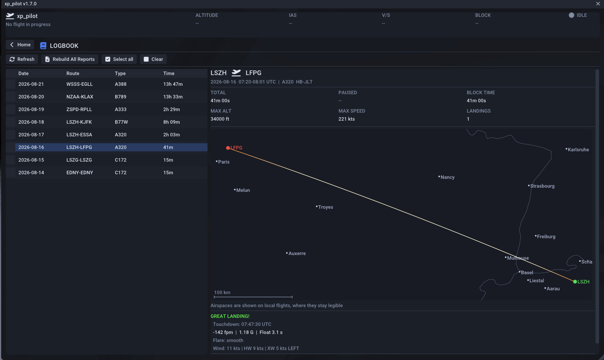
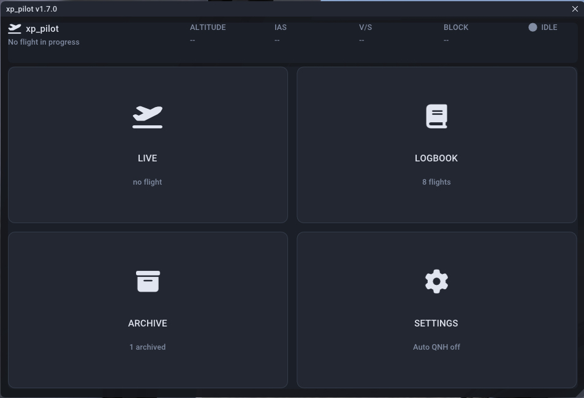

# xp_pilot


Native X-Plane 12 plugin for **macOS (ARM + Intel)**, **Linux**, and **Windows**.

- **Flight Logger** — records every flight and generates an HTML logbook with route maps and landing analysis
- **Auto QNH** — automatically keeps the altimeter in sync with actual sea-level pressure

## Contents

- [Quick start](#quick-start)
- [Why xp_pilot?](#why-xp_pilot)
- [Installation](#installation)
- [Where your data lives](#where-your-data-lives)
- [Features](#features)
- [The logbook window](#the-logbook-window)
- [Using the plugin](#using-the-plugin)
- [Aircraft profiles](#aircraft-profiles)
- [FAQ](#faq)
- [For developers](#for-developers)

## Quick start

1. Download `xp_pilot.zip` from the [releases page](../../releases) and copy the `xp_pilot` folder into your X-Plane 12 plugins directory (see [Installation](#installation)).
2. In X-Plane, open **Plugins → xp_pilot → Open / Close Logbook**.
3. Optional: open the **Settings** screen from the logbook's home screen to toggle disk logging, Auto QNH, and on-screen messages.

No FlyWithLua required. No account or subscription.

## Why xp_pilot?

- **Your data stays on your machine.** Flights, landings, and reports are plain JSON and HTML files in your X-Plane folder. No cloud, no server, no account — nothing to shut down, nothing to leak.
- **No login, no subscription, no telemetry.** Install it and it works. You own your logbook.
- **First-class native builds for macOS, Linux and Windows.** Universal binary on Apple Silicon and Intel Macs — a platform most X-Plane tools treat as an afterthought.
- **Flight recording runs offline.** No internet needed while flying, and the in-sim track map draws entirely from local data — airspaces come from X-Plane's own database, coastlines ship with the plugin. The only outbound traffic is the map tiles an HTML report fetches from [OpenFreeMap](https://openfreemap.org/) when you open it in a browser, and the SkyVector chart when you click a position link. No API key is involved, so nothing personal is ever embedded in a report you share.

## Installation

Download the ZIP from the [releases page](../../releases) and copy the `xp_pilot` folder into your X-Plane 12 plugins directory:

```
X-Plane 12/Resources/plugins/xp_pilot/
├── mac_x64/xp_pilot.xpl   ← macOS (ARM + Intel universal binary)
├── lin_x64/xp_pilot.xpl   ← Linux (x86_64)
├── win_x64/xp_pilot.xpl   ← Windows
└── data/
    ├── flight_logger_profiles.json   ← bundled config (read-only)
    ├── coastlines.dat                ← coastlines, lakes and borders (read-only)
    └── cities.dat                    ← place names for the track map (read-only)
```

X-Plane loads the correct platform binary automatically. Nothing here needs an API key or an account.

**Requirements:** macOS 12.0+ (arm64 / x86_64), Linux (x86_64), or Windows · X-Plane 12

## Where your data lives

Flight records, HTML reports, settings, and the flight index are stored under X-Plane's Output directory so they survive plugin updates:

```
<X-Plane>/Output/x_pilot_reports/
├── flights/              ← JSON flight records
│   └── archived/
├── reports/              ← HTML reports (one per flight)
│   └── archived/
├── index.html            ← list of all flights
└── settings.json         ← feature toggles from the logbook window
```

On first start after an upgrade from older versions, xp_pilot migrates any data still in the plugin's `data/` folder to this location once (guarded by a `.migrated` marker).

**Why `settings.json` lives here and not next to the plugin.** It looks misplaced — the folder is named after the reports — but anything inside the plugin folder is owned by the updater. The SkunkCrafts updater synchronises that tree against its file list, so a settings file kept there would be overwritten or removed on every update, taking your toggles with it. Everything the plugin writes therefore lives outside the tree; the plugin folder holds only bundled, read-only files (`flight_logger_profiles.json`, `coastlines.dat` and `cities.dat`), which are meant to be replaced on update.

## Features

### Flight Logger

Records a complete flight from engine start to shutdown and saves it as JSON plus an HTML report.

**Capabilities**

- Detects takeoff, airborne phase, landing, and shutdown automatically via a state machine
- Samples track points every 10 seconds (lat/lon, altitude, speed, vertical speed)
- Captures landing data at touchdown: descent rate (fpm), G-force, pitch, float time, flare quality, wind (headwind/crosswind)
- Records the **touchdown speed** — indicated airspeed and ground speed at the moment the gear touches
- Places the touchdown **on the runway**: runway identifier, distance past the threshold, runway remaining, and centerline deviation
- Records **how the aircraft was configured** and **what the weather was** — gear, flaps, speedbrake, autopilot, visibility, ceiling and temperature
- Rates each landing: **BUTTER!** / **GREAT LANDING!** / **ACCEPTABLE** / **HARD LANDING!** / **WASTED!**
- Thresholds are profile-based per aircraft category (see [Aircraft profiles](#aircraft-profiles))
- HTML reports include a mini route map and charts; `index.html` lists all flights
- Shows the flight in progress live in the logbook window — no need to land first
- Opens the live position or a recorded touchdown point on a [SkyVector](https://skyvector.com/) aeronautical chart in the browser



<details>
<summary><strong>Live view of the running flight</strong></summary>

The **Live** screen of the logbook window shows the flight currently being recorded, so you can check the route flown so far without ending the flight or opening an HTML report.

- **Where you are** — position, altitude, indicated airspeed, vertical speed and true heading sit in the status bar at the top of the window, visible from every screen. Height above ground is on the Live screen itself. Updated every frame. The **SkyVector** button opens the current coordinates on an aeronautical chart in your browser.
- **How long you have been flying** — the running block time, pause-aware, counted exactly as the finished report counts it.
- **Where you have been** — the route from takeoff up to this moment on the same track map the logbook detail view uses. It follows the 10-second sampling grid, so the first line appears after about 20 seconds of flight.
- **What you have done** — the maxima reached so far, plus any landing already made during the flight (a touch-and-go en route) with its full rating.

Nothing is written to disk — this is a read-only view of what the recorder already holds in memory. With *Write flight logs to disk* switched off no track is sampled, so the map is replaced by a note; all other live values still work.

</details>

<details>
<summary><strong>The track map in the logbook window</strong></summary>

The in-sim map draws the flown route over geographic and aeronautical context, all from local data — no network, no API key, and it works with the sim offline.

- **The track itself** ramps from orange to near-white with altitude, so a climb reads at a glance. It is the only warm, saturated element on the map; everything else stays deliberately quiet.
- **Airspaces** come from X-Plane's own database (`Resources/default data/airspaces/`). Violet outlines mark controlled airspace, red marks restricted, prohibited and danger areas. Airspaces that *surround* your route — the CTR around your departure airport — are included, not just those your track crosses.
- **Water and borders** are drawn from a Natural Earth extract bundled with the plugin: lakes as filled teal shapes, coastlines in the same teal, country borders in muted grey.
- **Place names** label the route, largest first. A label is dropped when it would overlap another one, so names stay readable where cities cluster; departure and arrival keep their spot regardless.
- **Scale bar and ICAO labels** for departure and arrival, plus pause markers in violet.

**What is shown depends on how far you flew.** Airspaces only appear on local flights — a Zurich-Paris leg crosses several hundred of them, almost all irrelevant at cruise level, so beyond roughly 330 km the map shows geography instead. Place names and borders answer "where did I fly" at that scale far better than outlines do.

The projection is Web Mercator with the aspect ratio preserved, so a north-south leg keeps its shape instead of being squashed, and routes crossing the date line stay in one piece. Loading runs on a background thread — on a large route the map appears without its overlays for a moment rather than stalling the window.

If X-Plane's airspace database is missing, or a bundled data file was not installed, that layer is simply left out.

</details>

<details>
<summary><strong>Pause-aware block time</strong></summary>

Time spent with the sim paused is excluded from block time. When a flight was paused, the report and logbook show the full calculation: total time, pause total, and net block time.

- Each pause is marked in yellow on the route — in the HTML report's map (hover for its duration) and in the logbook window's track view.
- The clock starts with the takeoff roll, not with engine start. Pausing *before* that — sitting on the runway ready for departure — happens outside the block time and is therefore not recorded as a pause; there is nothing yet to subtract it from.

</details>

<details>
<summary><strong>Bounce detection</strong></summary>

When the main gear touches down, lifts off, and touches again before settling, each additional touchdown counts as a bounce. The landing rating reflects the **hardest** impact, not the cushioned final settle.

- A low-altitude rebound (AGL &lt; 5 ft) counts as a bounce.
- A higher climb still triggers a separate Touch-and-Go entry as before.

</details>

<details>
<summary><strong>Configuration and conditions at touchdown</strong></summary>

The numbers alone don't explain a landing. A gentle touchdown flown by the autopilot in clear air is not the same piece of flying as the identical figures hand-flown at night in rain — so xp_pilot records the circumstances alongside the metrics.

- **Gear** — down and locked, or how far it actually got. Fixed-gear aircraft are reported as such rather than being judged.
- **Flaps** — the flap system's actual deployment at touchdown. The flap handle is also sampled at the 50 ft gate, so a selection made in the flare is flagged as *changed below 50 ft*.
- **Speedbrake** — armed, deployed, or retracted.
- **Flown by** — whether the autopilot master was still engaged when the gear touched. A **BUTTER!** rating means rather less if the autopilot flew the landing, and now you can see which it was. Flight-director-only counts as hand-flown.
- **Conditions** — reported visibility, the lowest broken or overcast ceiling above the airport, outside air temperature, and whether it was raining. Summarised as **VMC** or **IMC** (below 5 km visibility or a ceiling under 1500 ft AGL).

The ceiling is referenced to the elevation of the airport you landed at, not to the ground under the aircraft, so it reads as a ceiling rather than as a height above terrain.

These rows appear in the HTML report's landing card; the landing popup adds a compact summary line. Landings recorded before this data existed simply omit the rows.

</details>

<details>
<summary><strong>Runway analysis</strong></summary>

Each landing is placed on the runway it was actually made on, so you can see *where* you touched down — not just how hard.

- **Runway identifier** — picked from the airport layout by touchdown position and heading, so parallel runways are told apart correctly.
- **Touchdown point** — distance past the threshold in metres and feet, plus how much of the runway you used.
- **Runway remaining** — how much pavement was left ahead of you.
- **Centerline deviation** — how far left or right of the centerline you put it down.
- **Touchdown position** — the coordinates of the touchdown, linked to the spot on SkyVector in the HTML report.

Displaced thresholds are taken into account, so the distance is measured from the actual landing threshold rather than the start of the pavement.

The runway layout is read from X-Plane's global airport database. The lookup runs on a background thread during the approach, so there is no frame hitch at touchdown. It can be switched off on the Settings screen.

Landings that cannot be matched to a runway — grass strips, water landings, helicopter set-downs, or airports missing from the database — simply omit the runway rows. Airports supplied by Custom Scenery add-ons fall back to the global layout, which may differ slightly for heavily modified airfields.

</details>

### Auto QNH

- Monitors the difference between actual QNH and the pilot's altimeter setting
- Shows an on-screen warning when the drift exceeds ~1.7 hPa
- Optional auto mode (toggle in Settings) silently syncs both pilot and copilot baro to actual QNH
- Shows a second warning if pilot and copilot altimeters disagree by more than 0.01 inHg

| Command | Description |
|---|---|
| `xp_pilot/qnh/set_qnh` | One-shot: set both baros to current QNH |
| `xp_pilot/qnh/set_flightlevel` | One-shot: set both baros to 29.92 inHg |

## The logbook window

The in-sim window is laid out like a tablet: a live status bar across the top, and a home screen of four tiles that lead into the detail screens.



Each tile carries an icon — a departing aircraft for Live, a book for Logbook, an archive box, and a gear for Settings.

**Status bar** — always visible, on every screen. Shows the aircraft type and tail number, the departure airport and current position, and the live figures: altitude, indicated airspeed, vertical speed and running block time. A red **REC** marks a flight being recorded; between flights it reads **IDLE** and the figures show placeholders, so the bar never changes height.

**The four screens**

| Tile | What it opens |
|---|---|
| **Live** | The flight in progress — track map, block time, maxima and any landing already made |
| **Logbook** | All recorded flights: list on the left, full detail on the right, with report / archive / delete actions |
| **Archive** | Flights moved out of the active logbook, same layout, delete only |
| **Settings** | Every feature toggle, saved immediately to `settings.json` |

**Navigation** — each screen has a **‹ Home** button in its top-left corner. `Esc` steps back to the home screen, and pressing it again on the home screen closes the window. The window can be moved and resized freely, but never beyond the screen edge. The **UI scale** setting adjusts fonts and spacing in 5% steps; **Plugins → xp_pilot → Reset UI Scale & Window Size** restores the default from outside the window.

## Using the plugin

### Plugin menu

Under **Plugins → xp_pilot**:

| Item | Description |
|---|---|
| Open / Close Logbook | Open the in-sim logbook window (live view, flight history, archive, and all settings) |
| Show Last Landing Rating | Re-open the landing popup for the most recent landing |
| Reset UI Scale & Window Size | Back to 100% with a centred window. In the plugin menu on purpose: it stays reachable even if the window itself has been scaled out of reach |

### Commands

All three can be bound to a key or joystick button in X-Plane's control settings.

| Command | Description |
|---|---|
| `xp_pilot/logbook/toggle` | Open / close the logbook window |
| `xp_pilot/logbook/show_last_landing` | Show the landing popup for the most recent landing |
| `xp_pilot/ui/reset_layout` | Reset UI scale to 100% and recentre the window |

`show_last_landing` replays the last landing of the current session. After restarting the sim it falls back to the newest landing in your logbook, so a landing can be reviewed — or captured for a screenshot — at any time. It works even when the automatic post-touchdown popup is switched off.

### Settings

All feature toggles live on the **Settings** screen of the logbook window. Changes are saved immediately to `settings.json` under [Where your data lives](#where-your-data-lives) and persist across sessions.

| Setting | Default | Description |
|---|---|---|
| Write flight logs to disk | on | When off, no JSON flight file and no HTML report are written, and no track is sampled — so the Live screen shows no route map. Flight tracking, live position values and on-screen messages still work. |
| Auto QNH | off | Silently syncs pilot and copilot altimeter to the actual sea-level pressure (skipped on standard 29.92). |
| Show QNH warning messages | on | Gates the on-screen *CHECK ALTIMETER* and *ALTIMETER DISAGREE* warnings. Independent of Auto QNH. |
| Show flight logger status messages | on | Gates the on-screen overlays (*DEP cached*, *REC Flight recording started*, *Touch-and-Go*, *Flight saved*, etc.). |
| Show landing rating popup | on | Gates the post-touchdown popup with landing quality (BUTTER! / GREAT / ACCEPTABLE / HARD / WASTED) and metrics. Independent of the log-writing toggle. |
| Popup position | Top center | Where the landing popup appears: any of the four corners, top or bottom centre, or dead centre. |
| Analyze touchdown point | on | Locates each touchdown on its runway (identifier, distance past threshold, centerline deviation). Reads X-Plane's airport database once per flight. |
| UI scale | 100% | Scales fonts and spacing from 80% to 200% in 5% steps, via **−** / **+** buttons. Useful on high-DPI displays and TV-distance setups. The window never grows beyond your screen, so a large scale shows less at once rather than becoming unreachable. **Reset** returns to 100% and recentres. |

Each toggle is independent, so combinations like "no disk logs but still show the landing rating" are supported for pilots who use external flight-reporting tools.

## Aircraft profiles

Landing quality thresholds are configured per aircraft category in `data/flight_logger_profiles.json` (inside the plugin folder). The plugin matches the aircraft's ICAO type code against the `match` strings in order.

| Profile | Butter | Great | Acceptable | Hard |
|---|---|---|---|---|
| `ultra_light` | &lt; 75 fpm | &lt; 150 fpm | &lt; 250 fpm | &lt; 400 fpm |
| `light_ga` | &lt; 100 fpm | &lt; 200 fpm | &lt; 300 fpm | &lt; 500 fpm |
| `medium_ga` | &lt; 125 fpm | &lt; 250 fpm | &lt; 350 fpm | &lt; 600 fpm |
| `turboprop` | &lt; 150 fpm | &lt; 275 fpm | &lt; 400 fpm | &lt; 650 fpm |
| `vlj` | &lt; 200 fpm | &lt; 350 fpm | &lt; 500 fpm | &lt; 750 fpm |
| `heavy_jet` | &lt; 250 fpm | &lt; 400 fpm | &lt; 600 fpm | &lt; 850 fpm |

Descent rate is not the only criterion. Vertical acceleration is graded alongside it — at 1.4 / 1.7 / 2.1 / 2.6 G for the same five steps — and the **worse of the two decides**, the way helicopter landings have always been judged in xp_pilot. An aircraft dropped flat onto the runway records a modest descent rate and a hefty G reading; that landing no longer passes on the rate alone. The G thresholds are the same for every profile, so they are not part of the table above.

A crosswind still buys allowance on the descent rate: up to 40% in a full 30-knot crosswind, and nothing at all in calm air.

The `shutdown_trigger` setting controls when a flight is finalised: `engine` (all engines off), `beacon` (beacon light off), or `nav_light` (nav lights off). Default is `engine`; can be overridden per aircraft entry.

### Aircraft the list does not name

An aircraft whose ICAO code is missing from the list is no longer rated against a generic profile. It is classified from its airframe instead — maximum takeoff mass, engine count and engine type place it in one of the profiles above. A jet up to 20 t goes to `vlj` and anything heavier to `heavy_jet`, a turboprop to `turboprop`, and a piston single to `ultra_light`, `light_ga` or `medium_ga` at 600 kg and 1500 kg. A piston twin never lands in the two light profiles, whatever it weighs. Only when the sim reports no usable mass does the old `medium_ga` fallback still apply.

Helicopters were already covered: X-Plane reports the airframe category itself, so an unlisted helicopter is rated against `turbine_helicopter` rather than a far too lax fixed-wing profile.

Every aircraft load writes the outcome to X-Plane's `Log.txt`, so a rating that looks wrong can be traced to the data behind it:

```
[xp_pilot] Aircraft 'EVOT': m_max=1950 engines=1 turbine -> profile turboprop [-150/-275/-400/-650]
```

### Choosing the profile yourself

When a profile does not suit an aircraft you fly, assign one in `settings.json` under [Where your data lives](#where-your-data-lives):

```json
"aircraft_profiles": {
  "B77W": "heavy_jet",
  "C208": "turboprop"
}
```

The key is the ICAO type code exactly as the log line above prints it. It is matched exactly rather than as a substring, so `B77` will not catch a B77W — this is deliberate, since a short entry would otherwise capture every variant of a type at once. Your choice wins over both the bundled list and the airframe classification. A profile name that does not exist is ignored, which leaves the normal lookup in charge rather than a flight without thresholds.

Unlike `flight_logger_profiles.json`, `settings.json` lives outside the plugin folder and survives updates.

## FAQ

### Star Wars rain effect

Earlier versions of xp_pilot tried to hide X-Plane's 3D rain particles at high speed — the so-called "Star Wars" streaks. We removed this feature because **it never worked reliably from a plugin, on any operating system.**

X-Plane's rain system is an internal setting that Laminar Research does not expose to regular plugins. The popular Lua script many pilots use only works because **FlyWithLua (Complete Edition)** has special permission to reach into those internal settings. A normal X-Plane plugin like xp_pilot does not — attempts to switch the rain off were silently ignored by the sim.

If you want the effect, install [FlyWithLua NG (Complete Edition)](https://forums.x-plane.org/index.php?/files/file/38445-flywithlua-ng-next-generation-edition-for-x-plane-11-win-lin-mac/) and drop a copy of `no_starwars_rain.lua` into its scripts folder.

### Release notes

Version history and detailed changelogs: [RELEASE.md](RELEASE.md) and the [GitHub releases page](../../releases).

---

## For developers

Project context for AI assistants: [.cursor/rules/xp-pilot.mdc](.cursor/rules/xp-pilot.mdc) (Cursor) and [CLAUDE.md](CLAUDE.md) (Claude Code). See [RELEASE.md](RELEASE.md) for the release process and changelog.

### Build from source

**Prerequisites:** CMake 3.21+, Xcode Command Line Tools (macOS), GCC/Clang + libGL-dev (Linux), or MSVC (Windows)

```bash
make setup    # Download X-Plane SDK, Dear ImGui, nlohmann/json, Catch2
make build    # Build the plugin (universal binary on macOS)
make test     # Run Catch2 unit tests
make install  # Install + code-sign to X-Plane (macOS only)
```

### Project layout

```
src/
├── main.cpp            Plugin entry points, draw callback, menu
├── flight_logger.*     State machine, data acquisition, JSON save
├── html_report.*       HTML/index generation, JSON parsing
├── logbook_ui.*        Window lifecycle, input bridge, screen routing
├── ui_theme.*          Colour palette, style, embedded fonts, icon defines
├── ui_widgets.*        Shared building blocks (tiles, metric cells, headers)
├── ui_home.*           Live status bar and the home screen tiles
├── ui_flight_view.*    Read-only presentation of one flight
├── ui_flight_list.*    Logbook and archive screen (one implementation, two lists)
├── fonts/              Generated font headers (see tools/generate_fonts.sh)
├── runway_data.*       apt.dat parsing (runway thresholds and widths)
├── runway_geometry.hpp Touchdown-to-runway placement math (header-only)
├── airspace_data.*     OpenAir parsing of X-Plane's airspace database
├── coastline_data.*    Bundled coastlines, lakes and country borders
├── city_data.*         Bundled place names, population-ordered
├── map_overlay_cache.* Background loading of all three, off the draw thread
├── geo_longitude.hpp   Date-line-safe longitude handling (header-only)
└── auto_qnh.*          Altimeter monitoring and auto-sync
```

`data/coastlines.dat` and `data/cities.dat` are generated from Natural Earth by
`tools/build_map_data.py` (coastlines and borders at 1:50m, lakes and places at 1:10m).
Re-run it only when the source data should be refreshed — the results are committed.

`sdk/` and `vendor/` are populated by `make setup` and are not committed to the repository.

### Embedded fonts

The UI ships with two subset fonts compiled into the binary, so a build needs neither
network access nor a font toolchain. Regenerate them with `./tools/generate_fonts.sh`
after changing the icon set:

| Font | Use | License |
|---|---|---|
| Roboto Medium (Latin-1 subset) | all UI text | Apache License 2.0 |
| Font Awesome 6 Free Solid (18 glyphs) | icons | Font: SIL OFL 1.1 · Icons: CC BY 4.0 |

### Bundled map data

| Data | Use | License |
|---|---|---|
| Natural Earth (`data/coastlines.dat`, `data/cities.dat`) | coastlines, lakes, borders and place names on the track map | Public domain |
| X-Plane airspace database | airspace outlines on the track map | Read from the user's own X-Plane install; nothing is copied or redistributed |

Full third-party inventory: [3part-lizenz.md](3part-lizenz.md).
